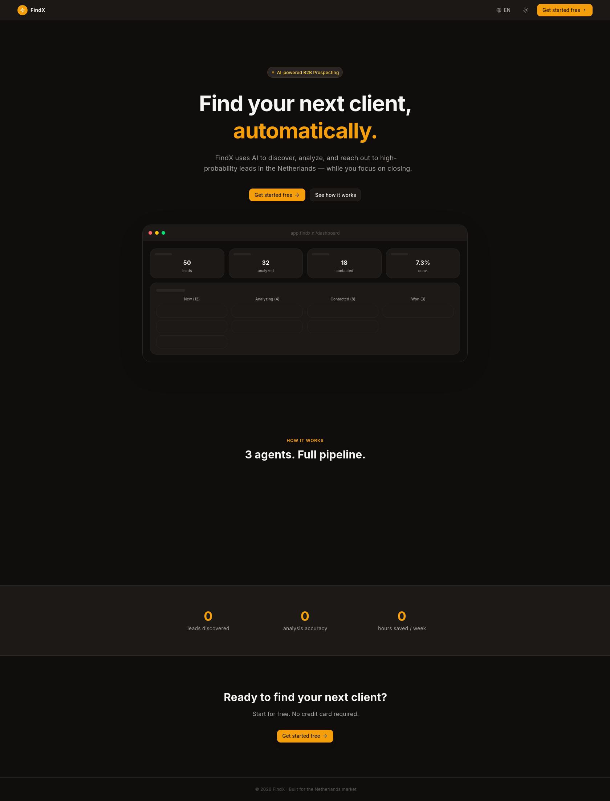

<div align="center">


<br/>

[](https://find-x-agents-findx.vercel.app)
[](https://www.typescriptlang.org/)
[](https://react.dev/)
[](https://supabase.com)

<h3>🔥 AI-Powered B2B Prospecting — Discover · Analyze · Outreach</h3>

<p>FindX uses a 3-stage AI pipeline to find real businesses, visit their websites, score their digital gaps, and write personalized cold emails — all automatically.</p>

</div>

---

## ✨ What Makes FindX Different

| Feature | Description |
|---|---|
| 🔍 **Real Website Scraping** | Visits every lead's website — extracts emails, phones, SSL status, load speed, social links |
| 🧠 **Grounded AI Scoring** | Score is calculated from real metrics, not AI guesses. No hallucination. |
| 🚫 **Directory Filtering** | Automatically rejects Clutch, Sortlist, DesignRush, blog posts, and 40+ aggregator domains |
| ✉️ **Hyper-Personalized Outreach** | Each email references a specific verified fact from the scraped site |
| 📊 **Kanban Pipeline** | Visual drag-and-drop board: New → Qualified → Won |
| 📱 **Mobile App** | Full iOS/Android app with real-time notifications |
| 🌍 **Global + Multi-Language** | Supports Arabic, English, Dutch, French, Spanish, German |

---

## 🖥️ Screenshots

<div align="center">

| Landing Page | Dashboard | Pipeline |
|:---:|:---:|:---:|
|  |  |  |

</div>

---

## 🏗️ Architecture

```
┌─────────────────────────────────────────────────────────────┐
│                        AI Pipeline                          │
│                                                             │
│  ┌──────────────┐   ┌──────────────┐   ┌────────────────┐  │
│  │   Discover   │──▶│   Analyze    │──▶│    Outreach    │  │
│  │              │   │              │   │                │  │
│  │ Tavily Search│   │ Scrape Site  │   │ Generate Email │  │
│  │ Filter Dirs  │   │ Real Metrics │   │ Grounded Facts │  │
│  │ Extract Cos  │   │ Score 0–100  │   │ Personalized   │  │
│  └──────────────┘   └──────────────┘   └────────────────┘  │
└─────────────────────────────────────────────────────────────┘
         │                   │                    │
         ▼                   ▼                    ▼
   PostgreSQL           Gemini 2.5           Resend API
   (Supabase)           Flash AI             (Email Send)
```

---

## 📦 Monorepo Structure

```
findx/
├── artifacts/
│   ├── findx/               # 🌐 Web App (Vite + React + TailwindCSS)
│   │   └── src/
│   │       ├── pages/       # Route pages
│   │       ├── components/  # UI components
│   │       └── lib/         # API client, auth, i18n
│   ├── api-server/          # ⚙️  REST API (Express 5 + TypeScript)
│   │   └── src/
│   │       ├── routes/      # All endpoints
│   │       ├── lib/         # AI engine, scraper, agents
│   │       └── middleware/  # Auth, rate-limit
│   ├── findx-mobile/        # 📱 Mobile App (Expo + React Native)
│   ├── findx-pitch-deck/    # 📊 Pitch Deck
│   └── findx-promo/         # 🎬 Promo Video
└── lib/
    └── db/                  # 🗄️  Shared Drizzle Schema + Migrations
```

---

## 🛠️ Tech Stack

<div align="center">

| Layer | Technology |
|:---:|:---|
| **Frontend** | Vite · React 18 · TypeScript · TailwindCSS |
| **Backend** | Express 5 · TypeScript · Drizzle ORM |
| **Database** | PostgreSQL via Supabase |
| **Auth** | Supabase Auth · Google OAuth |
| **AI** | OpenRouter · Gemini 2.5 Flash |
| **Scraping** | Native fetch · Custom parser |
| **Search** | Tavily API |
| **Email** | Resend API |
| **Mobile** | Expo · React Native · expo-router |
| **Package Manager** | pnpm (monorepo) |
| **Deployment** | Vercel (frontend) · Render (API) |

</div>

---

## 🚀 Quick Start

### Prerequisites

- Node.js `>= 22`
- pnpm `>= 10` — `npm install -g pnpm`
- A [Supabase](https://supabase.com) project
- API keys: **Tavily**, **Resend**, **OpenRouter** or **Gemini**

### 1. Clone & Install

```bash
git clone https://github.com/amrolela100-sketch/FindXAgents.git
cd FindXAgents
pnpm install
```

### 2. Configure Environment Variables

```bash
cp artifacts/api-server/.env.example artifacts/api-server/.env
cp artifacts/findx/.env.example artifacts/findx/.env
cp artifacts/findx-mobile/.env.example artifacts/findx-mobile/.env
```

#### API Server (`artifacts/api-server/.env`)

```env
DATABASE_URL=postgresql://...
SUPABASE_URL=https://xxx.supabase.co
SUPABASE_SERVICE_ROLE_KEY=eyJ...
OWNER_EMAIL=admin@yourdomain.com
OWNER_PASSWORD=your-secure-password
ADMIN_EMAILS=admin@yourdomain.com
TAVILY_API_KEY=tvly-...
RESEND_API_KEY=re_...
OPENROUTER_API_KEY=sk-or-...
GEMINI_API_KEY=AIza...
```

#### Web App (`artifacts/findx/.env`)

```env
VITE_SUPABASE_URL=https://xxx.supabase.co
VITE_SUPABASE_ANON_KEY=eyJ...
# Local dev: point directly to the API server
VITE_API_URL=http://localhost:3000/api
# Production (Vercel): always use /api — Vercel proxies it to Render (see vercel.json)
# VITE_API_URL=/api
VITE_ADMIN_EMAILS=admin@yourdomain.com
```

### 3. Apply Database Schema

**Production / staging** — run the migration runner (safe, incremental, idempotent):

```bash
pnpm --filter @workspace/db run migrate
```

**Local development only** — push schema directly without generating migration files:

```bash
pnpm --filter @workspace/db run push
```

> `push` is for rapid iteration on a local DB. Never run it against a shared or production database — use `migrate` instead.

**Check for drift** (compares schema file against live DB, no changes applied):

```bash
pnpm --filter @workspace/db run check
```

### 4. Run in Development

```bash
# API server  (port 3000)
pnpm --filter @workspace/api-server run dev

# Web app     (port 5173) — open a second terminal
pnpm --filter @workspace/findx run dev

# Mobile app  — open a third terminal
pnpm --filter @workspace/findx-mobile run dev
```

---

## ☁️ Supabase Setup

1. Create a project at [supabase.com](https://supabase.com)
2. Enable **Google OAuth** → Auth → Providers → Google
3. Add redirect URLs in Auth → URL Configuration:
   - `http://localhost:5173/` (local)
   - `https://yourdomain.com/` (production)
   - `findx-mobile://auth/callback` (mobile)
4. Copy **Project URL** and **anon / service role keys** to your `.env` files

---

## 🔐 Access Levels

| Role | Access |
|---|---|
| **User** | Full access to own leads, pipeline, outreach |
| **Admin** | Everything + manage all users' leads |
| **Owner** | Everything + operator panel at `/owner` |

> Set `ADMIN_EMAILS` in your API `.env` to grant admin access.  
> Set `OWNER_EMAIL` + `OWNER_PASSWORD` to enable the `/owner` panel.

---

## 🏭 Production Build

```bash
# Build all packages
pnpm run build

# Or individually
pnpm --filter @workspace/api-server run build
pnpm --filter @workspace/findx run build
```

Deploy frontend to **Vercel**, API to **Render** — see [`DEPLOY.md`](./DEPLOY.md) for full instructions.

---

## 🤝 Support

For setup assistance, reach out to the development team.

<div align="center">
<br/>
<sub>Built with ⚡ by the FindX team</sub>
</div>
